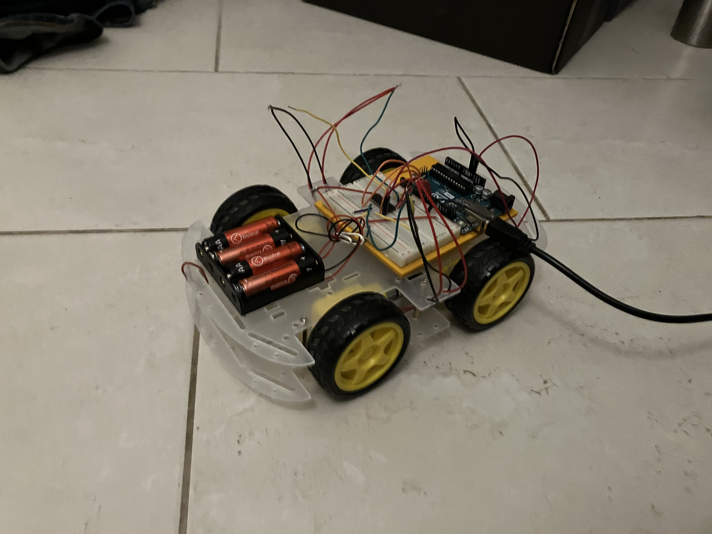
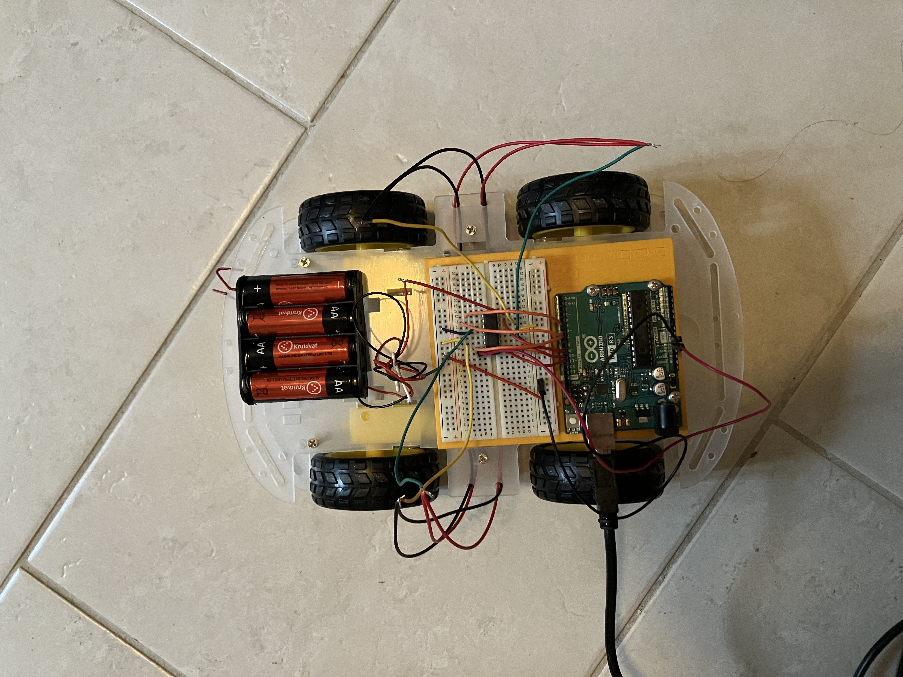
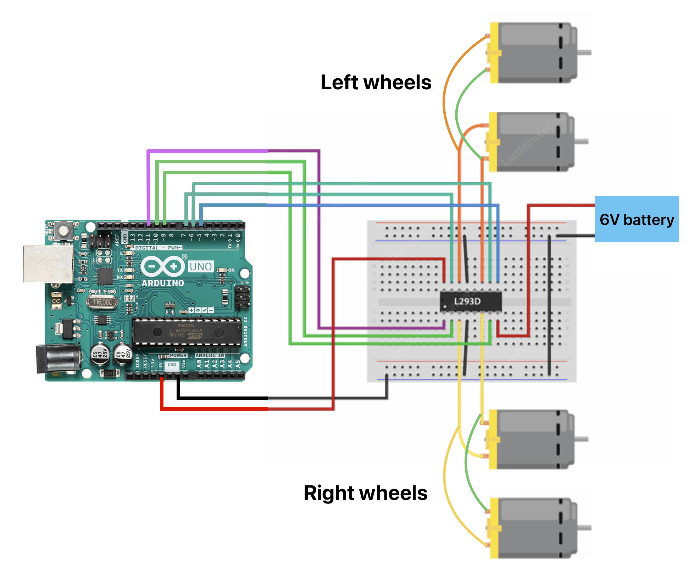

# handGestureControl
The goal of this project is to train a YOLOv5 network to recognise hand gestures via the webcam which will be used to steer a 4 wheeled robot.

## The robot.
The robot is a robot with 4 wheels and 4 motors, that are controlled by an Arduino Uno. The robot will drive using skid steering.
Because I had no access to a wireless module, the Arduino will be controlled with a cable that is directly connected to my computer. 
Here is a layout of the cables of the robot. 

## The YOLOv5 network
I used a YOLOv5 small network because I did not have access to a GPU for training. The small network had a nice weigh off for performance vs training time. 
I trained the network to recognise 5 commands to control the robot: forward, backward, left, right and stop. The signs for these commands were taken from sign language where: "F" is forward, "B" is backward, "L" is left, "R" is right and "S" is stop.
<add photos for commands>

The data used initially consisted of about 80 images for each command and 10 background images using a 0.6/0.2/0.2 train/val/test split. This resulted in a model that was very capable of detecting all commands except for left, it would confuse left for right very often. So I added 60 images for left and 40 more for right, and trained a new network from scratch. So the total data amounts are: train: 316, val: 102 and test: 98. 
All data was labeled using makesense.ai.

I trained the network for 30 epochs.

The confusion matrix for the test split can be seen in the image. The background images were every time falsely predicted as forward, I don't know why but there were only a couple of background images in the test set so it can be ignored. The other predictions look very good.
<add confusion matrix>

## How to run
To run the detector for only recognising the hand gestures run: "mainText.py" This will open a window with live webcam footage, that will draw bounding boxes around the hand gestures.
This network was trained on only my hands so it might not work for other hands.
A video of recognising: https://youtu.be/gft5G8m9LoI

To run the code for controlling the robot, you first got to upload the StandardFirmata code onto the Arduino. Leave the Arduino connected to the computer. Then run the command: "mainArd.py" This will open a window with live webcam footage that can recognise hand gestures and will send the corresponding commands to the Arduino which will make the robot move in the right direction.
A video of controlling the robot: https://youtu.be/GoWCpjxdV6w

